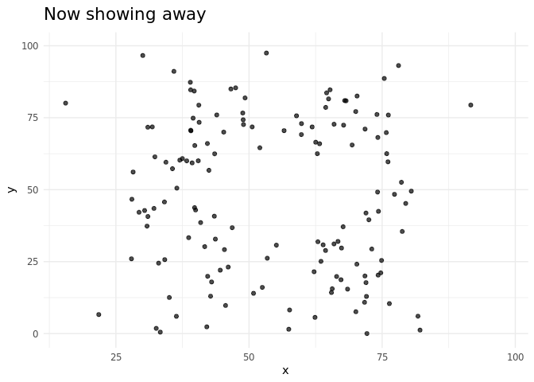
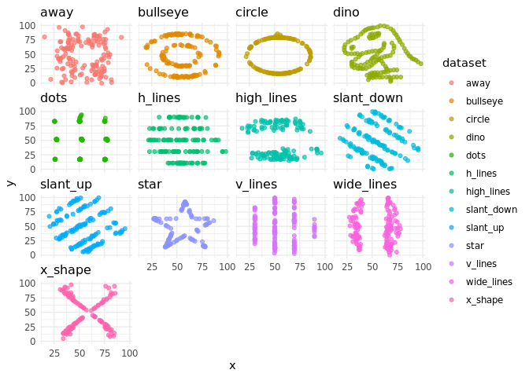
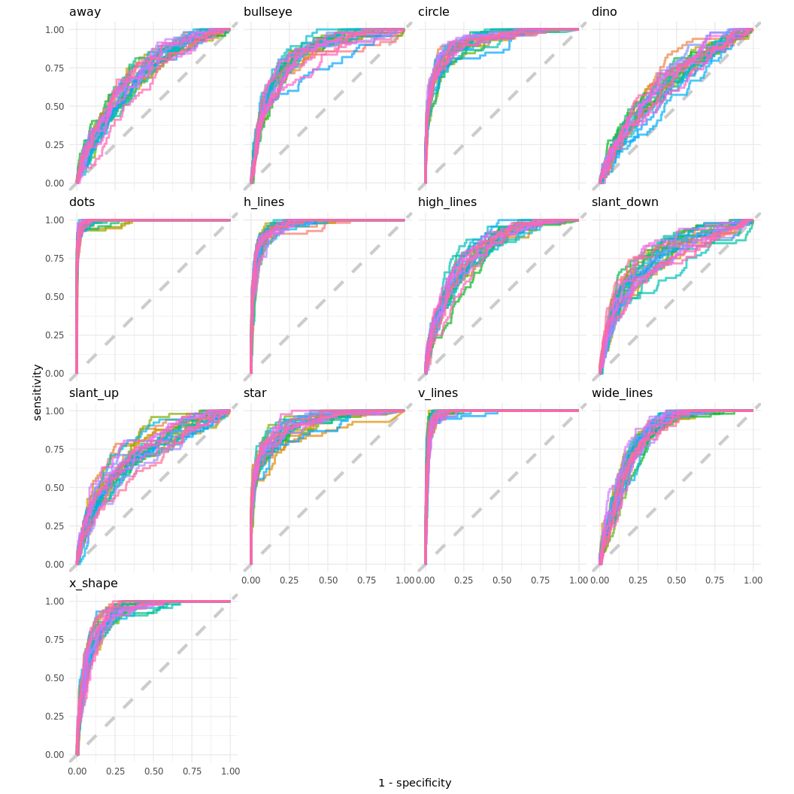
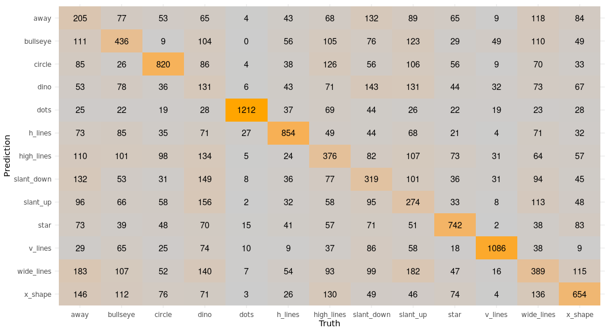
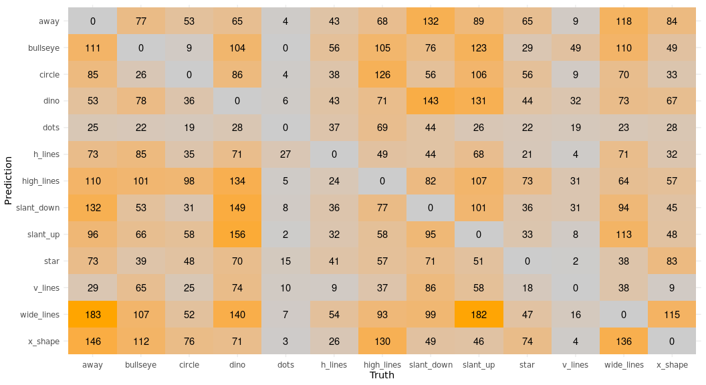

# TidyTuesday

Join the R4DS Online Learning Community in the weekly #TidyTuesday event!
Every week we post a raw dataset, a chart or article related to that data set, and ask you to explore the data.
While the data-set will be “tamed”, it will not always be tidy! As such you might need to apply various R for Data Science techniques to wrangle the data into a true tidy format.
The goal of Tidy Tuesday is to apply your R skills, get feedback, explore other’s work, and connect with the greater #RStats community!
As such we encourage everyone of all skills to participate!


# Load the weekly Data

Download the weekly data and make available in the `tt` object.


```r
#tt <- tt_load("2020-10-13") # Limited Exceeded
datasaurus <- readr::read_csv('https://raw.githubusercontent.com/rfordatascience/tidytuesday/master/data/2020/2020-10-13/datasaurus.csv')
```


# Readme

Take a look at the readme for the weekly data to get insight on the data-set.
This includes a data dictionary, source, and a link to an article on the data.


```r
# tt
datasaurus
```


# Glimpse Data

Take an initial look at the format of the data available.


```r
# tt %>% 
#   map(glimpse)

datasaurus %>% glimpse()
```

```
## Rows: 1,846
## Columns: 3
## $ dataset <chr> "dino", "dino", "dino", "dino", "dino", "dino", "dino", "dino…
## $ x       <dbl> 55.3846, 51.5385, 46.1538, 42.8205, 40.7692, 38.7179, 35.6410…
## $ y       <dbl> 97.1795, 96.0256, 94.4872, 91.4103, 88.3333, 84.8718, 79.8718…
```

# Wrangle

Explore the data and process it into a nice format for plotting! Access each data-set by name by using a dollarsign after the `tt` object and then the name of the data set.


```r
#datasaurus <- tt$datasaurus
datasaurus <- datasaurus %>% mutate(dataset = factor(dataset))

datasaurus %>% 
  group_by(dataset) %>% 
  summarise(across(c(x,y), 
                   list(mean = mean,
                        sd = sd)),
            x_y_cor = cor(x,y),
            count = n())%>% 
  kableExtra::kable(caption = "Similarities for X and Y in each dataset") %>% 
  kableExtra::kable_styling(bootstrap_options = "striped")
```

<table class="table table-striped" style="margin-left: auto; margin-right: auto;">
<caption>Similarities for X and Y in each dataset</caption>
 <thead>
  <tr>
   <th style="text-align:left;"> dataset </th>
   <th style="text-align:right;"> x_mean </th>
   <th style="text-align:right;"> x_sd </th>
   <th style="text-align:right;"> y_mean </th>
   <th style="text-align:right;"> y_sd </th>
   <th style="text-align:right;"> x_y_cor </th>
   <th style="text-align:right;"> count </th>
  </tr>
 </thead>
<tbody>
  <tr>
   <td style="text-align:left;"> away </td>
   <td style="text-align:right;"> 54.26610 </td>
   <td style="text-align:right;"> 16.76983 </td>
   <td style="text-align:right;"> 47.83472 </td>
   <td style="text-align:right;"> 26.93974 </td>
   <td style="text-align:right;"> -0.0641284 </td>
   <td style="text-align:right;"> 142 </td>
  </tr>
  <tr>
   <td style="text-align:left;"> bullseye </td>
   <td style="text-align:right;"> 54.26873 </td>
   <td style="text-align:right;"> 16.76924 </td>
   <td style="text-align:right;"> 47.83082 </td>
   <td style="text-align:right;"> 26.93573 </td>
   <td style="text-align:right;"> -0.0685864 </td>
   <td style="text-align:right;"> 142 </td>
  </tr>
  <tr>
   <td style="text-align:left;"> circle </td>
   <td style="text-align:right;"> 54.26732 </td>
   <td style="text-align:right;"> 16.76001 </td>
   <td style="text-align:right;"> 47.83772 </td>
   <td style="text-align:right;"> 26.93004 </td>
   <td style="text-align:right;"> -0.0683434 </td>
   <td style="text-align:right;"> 142 </td>
  </tr>
  <tr>
   <td style="text-align:left;"> dino </td>
   <td style="text-align:right;"> 54.26327 </td>
   <td style="text-align:right;"> 16.76514 </td>
   <td style="text-align:right;"> 47.83225 </td>
   <td style="text-align:right;"> 26.93540 </td>
   <td style="text-align:right;"> -0.0644719 </td>
   <td style="text-align:right;"> 142 </td>
  </tr>
  <tr>
   <td style="text-align:left;"> dots </td>
   <td style="text-align:right;"> 54.26030 </td>
   <td style="text-align:right;"> 16.76774 </td>
   <td style="text-align:right;"> 47.83983 </td>
   <td style="text-align:right;"> 26.93019 </td>
   <td style="text-align:right;"> -0.0603414 </td>
   <td style="text-align:right;"> 142 </td>
  </tr>
  <tr>
   <td style="text-align:left;"> h_lines </td>
   <td style="text-align:right;"> 54.26144 </td>
   <td style="text-align:right;"> 16.76590 </td>
   <td style="text-align:right;"> 47.83025 </td>
   <td style="text-align:right;"> 26.93988 </td>
   <td style="text-align:right;"> -0.0617148 </td>
   <td style="text-align:right;"> 142 </td>
  </tr>
  <tr>
   <td style="text-align:left;"> high_lines </td>
   <td style="text-align:right;"> 54.26881 </td>
   <td style="text-align:right;"> 16.76670 </td>
   <td style="text-align:right;"> 47.83545 </td>
   <td style="text-align:right;"> 26.94000 </td>
   <td style="text-align:right;"> -0.0685042 </td>
   <td style="text-align:right;"> 142 </td>
  </tr>
  <tr>
   <td style="text-align:left;"> slant_down </td>
   <td style="text-align:right;"> 54.26785 </td>
   <td style="text-align:right;"> 16.76676 </td>
   <td style="text-align:right;"> 47.83590 </td>
   <td style="text-align:right;"> 26.93610 </td>
   <td style="text-align:right;"> -0.0689797 </td>
   <td style="text-align:right;"> 142 </td>
  </tr>
  <tr>
   <td style="text-align:left;"> slant_up </td>
   <td style="text-align:right;"> 54.26588 </td>
   <td style="text-align:right;"> 16.76885 </td>
   <td style="text-align:right;"> 47.83150 </td>
   <td style="text-align:right;"> 26.93861 </td>
   <td style="text-align:right;"> -0.0686092 </td>
   <td style="text-align:right;"> 142 </td>
  </tr>
  <tr>
   <td style="text-align:left;"> star </td>
   <td style="text-align:right;"> 54.26734 </td>
   <td style="text-align:right;"> 16.76896 </td>
   <td style="text-align:right;"> 47.83955 </td>
   <td style="text-align:right;"> 26.93027 </td>
   <td style="text-align:right;"> -0.0629611 </td>
   <td style="text-align:right;"> 142 </td>
  </tr>
  <tr>
   <td style="text-align:left;"> v_lines </td>
   <td style="text-align:right;"> 54.26993 </td>
   <td style="text-align:right;"> 16.76996 </td>
   <td style="text-align:right;"> 47.83699 </td>
   <td style="text-align:right;"> 26.93768 </td>
   <td style="text-align:right;"> -0.0694456 </td>
   <td style="text-align:right;"> 142 </td>
  </tr>
  <tr>
   <td style="text-align:left;"> wide_lines </td>
   <td style="text-align:right;"> 54.26692 </td>
   <td style="text-align:right;"> 16.77000 </td>
   <td style="text-align:right;"> 47.83160 </td>
   <td style="text-align:right;"> 26.93790 </td>
   <td style="text-align:right;"> -0.0665752 </td>
   <td style="text-align:right;"> 142 </td>
  </tr>
  <tr>
   <td style="text-align:left;"> x_shape </td>
   <td style="text-align:right;"> 54.26015 </td>
   <td style="text-align:right;"> 16.76996 </td>
   <td style="text-align:right;"> 47.83972 </td>
   <td style="text-align:right;"> 26.93000 </td>
   <td style="text-align:right;"> -0.0655833 </td>
   <td style="text-align:right;"> 142 </td>
  </tr>
</tbody>
</table>

```r
datasaurus %>% 
  group_by(dataset) %>% 
  summarise(across(c(x,y), 
                   list(min = min,
                        max = max)
                   ))%>% 
  kableExtra::kable(caption = "Differences for X and Y in each dataset") %>% 
  kableExtra::kable_styling(bootstrap_options = "striped")
```

<table class="table table-striped" style="margin-left: auto; margin-right: auto;">
<caption>Differences for X and Y in each dataset</caption>
 <thead>
  <tr>
   <th style="text-align:left;"> dataset </th>
   <th style="text-align:right;"> x_min </th>
   <th style="text-align:right;"> x_max </th>
   <th style="text-align:right;"> y_min </th>
   <th style="text-align:right;"> y_max </th>
  </tr>
 </thead>
<tbody>
  <tr>
   <td style="text-align:left;"> away </td>
   <td style="text-align:right;"> 15.56075 </td>
   <td style="text-align:right;"> 91.63996 </td>
   <td style="text-align:right;"> 0.0151193 </td>
   <td style="text-align:right;"> 97.47577 </td>
  </tr>
  <tr>
   <td style="text-align:left;"> bullseye </td>
   <td style="text-align:right;"> 19.28820 </td>
   <td style="text-align:right;"> 91.73554 </td>
   <td style="text-align:right;"> 9.6915471 </td>
   <td style="text-align:right;"> 85.87623 </td>
  </tr>
  <tr>
   <td style="text-align:left;"> circle </td>
   <td style="text-align:right;"> 21.86358 </td>
   <td style="text-align:right;"> 85.66476 </td>
   <td style="text-align:right;"> 16.3265464 </td>
   <td style="text-align:right;"> 85.57813 </td>
  </tr>
  <tr>
   <td style="text-align:left;"> dino </td>
   <td style="text-align:right;"> 22.30770 </td>
   <td style="text-align:right;"> 98.20510 </td>
   <td style="text-align:right;"> 2.9487000 </td>
   <td style="text-align:right;"> 99.48720 </td>
  </tr>
  <tr>
   <td style="text-align:left;"> dots </td>
   <td style="text-align:right;"> 25.44353 </td>
   <td style="text-align:right;"> 77.95444 </td>
   <td style="text-align:right;"> 15.7718920 </td>
   <td style="text-align:right;"> 94.24933 </td>
  </tr>
  <tr>
   <td style="text-align:left;"> h_lines </td>
   <td style="text-align:right;"> 22.00371 </td>
   <td style="text-align:right;"> 98.28812 </td>
   <td style="text-align:right;"> 10.4639152 </td>
   <td style="text-align:right;"> 90.45894 </td>
  </tr>
  <tr>
   <td style="text-align:left;"> high_lines </td>
   <td style="text-align:right;"> 17.89350 </td>
   <td style="text-align:right;"> 96.08052 </td>
   <td style="text-align:right;"> 14.9139625 </td>
   <td style="text-align:right;"> 87.15221 </td>
  </tr>
  <tr>
   <td style="text-align:left;"> slant_down </td>
   <td style="text-align:right;"> 18.10947 </td>
   <td style="text-align:right;"> 95.59342 </td>
   <td style="text-align:right;"> 0.3038724 </td>
   <td style="text-align:right;"> 99.64418 </td>
  </tr>
  <tr>
   <td style="text-align:left;"> slant_up </td>
   <td style="text-align:right;"> 20.20978 </td>
   <td style="text-align:right;"> 95.26053 </td>
   <td style="text-align:right;"> 5.6457775 </td>
   <td style="text-align:right;"> 99.57959 </td>
  </tr>
  <tr>
   <td style="text-align:left;"> star </td>
   <td style="text-align:right;"> 27.02460 </td>
   <td style="text-align:right;"> 86.43590 </td>
   <td style="text-align:right;"> 14.3655905 </td>
   <td style="text-align:right;"> 92.21499 </td>
  </tr>
  <tr>
   <td style="text-align:left;"> v_lines </td>
   <td style="text-align:right;"> 30.44965 </td>
   <td style="text-align:right;"> 89.50485 </td>
   <td style="text-align:right;"> 2.7347602 </td>
   <td style="text-align:right;"> 99.69468 </td>
  </tr>
  <tr>
   <td style="text-align:left;"> wide_lines </td>
   <td style="text-align:right;"> 27.43963 </td>
   <td style="text-align:right;"> 77.91587 </td>
   <td style="text-align:right;"> 0.2170063 </td>
   <td style="text-align:right;"> 99.28376 </td>
  </tr>
  <tr>
   <td style="text-align:left;"> x_shape </td>
   <td style="text-align:right;"> 31.10687 </td>
   <td style="text-align:right;"> 85.44619 </td>
   <td style="text-align:right;"> 4.5776614 </td>
   <td style="text-align:right;"> 97.83761 </td>
  </tr>
</tbody>
</table>


# Visualize

Using your processed dataset, create your unique visualization.


```r
datasaurus %>% 
  ggplot(aes(x=x, y=y)) +
  geom_point(alpha=0.7) +
  theme_light() +
  theme_roboto()+
  ggtitle('Now showing {closest_state}') +
  transition_states(dataset,
                    transition_length = 2,
                    state_length = 3)
```

<!-- -->


```r
datasaurus %>% 
  ggplot(aes(x=x, y=y, color=dataset)) +
  geom_point(alpha=0.7) +
  theme_light() +
  facet_wrap(~dataset)+
  theme_roboto()
```

<!-- -->

# Save Image

Save your image for sharing. Be sure to use the `#TidyTuesday` hashtag in your post on twitter! 


```r
# This will save your most recent plot
ggsave(
  filename = "DatasauRus.png",
  device = "png")
```


# Can we predict which dataset a point belongs too?
+ The size of the datasate will make harder to get a good result.

## Build a model

```r
set.seed(332)
# Using K-Folds
dino_folds <- datasaurus %>% 
  bootstraps()

rf_spec <- rand_forest(trees = 1000) %>% 
  set_mode("classification") %>% 
  set_engine("ranger")

dino_wf <- workflow() %>% 
  add_model(rf_spec) %>% 
  add_formula(dataset ~ x+y)

doParallel::registerDoParallel()

dino_rs <- fit_resamples(
  dino_wf,
  resamples = dino_folds,
  control = control_resamples(save_pred = TRUE)
)
```


## Evaluate model


```r
collect_metrics(dino_rs)  %>%
kableExtra::kable(caption = "How good is the model?") %>%
kableExtra::kable_styling(bootstrap_options = "striped")
```

<table class="table table-striped" style="margin-left: auto; margin-right: auto;">
<caption>How good is the model?</caption>
 <thead>
  <tr>
   <th style="text-align:left;"> .metric </th>
   <th style="text-align:left;"> .estimator </th>
   <th style="text-align:right;"> mean </th>
   <th style="text-align:right;"> n </th>
   <th style="text-align:right;"> std_err </th>
  </tr>
 </thead>
<tbody>
  <tr>
   <td style="text-align:left;"> accuracy </td>
   <td style="text-align:left;"> multiclass </td>
   <td style="text-align:right;"> 0.4411169 </td>
   <td style="text-align:right;"> 25 </td>
   <td style="text-align:right;"> 0.0030614 </td>
  </tr>
  <tr>
   <td style="text-align:left;"> roc_auc </td>
   <td style="text-align:left;"> hand_till </td>
   <td style="text-align:right;"> 0.8429411 </td>
   <td style="text-align:right;"> 25 </td>
   <td style="text-align:right;"> 0.0018219 </td>
  </tr>
</tbody>
</table>


```r
dino_pred <- dino_rs %>% 
  collect_predictions()

dino_pred %>% names()
```

```
##  [1] "id"               ".pred_away"       ".pred_bullseye"   ".pred_circle"    
##  [5] ".pred_dino"       ".pred_dots"       ".pred_h_lines"    ".pred_high_lines"
##  [9] ".pred_slant_down" ".pred_slant_up"   ".pred_star"       ".pred_v_lines"   
## [13] ".pred_wide_lines" ".pred_x_shape"    ".row"             ".pred_class"     
## [17] "dataset"
```


```r
dino_pred %>%
  group_by(id) %>%
  ppv(dataset, .pred_class) #Prediction Positive Values
```

```
## # A tibble: 25 x 4
##    id          .metric .estimator .estimate
##    <chr>       <chr>   <chr>          <dbl>
##  1 Bootstrap01 ppv     macro          0.410
##  2 Bootstrap02 ppv     macro          0.424
##  3 Bootstrap03 ppv     macro          0.404
##  4 Bootstrap04 ppv     macro          0.411
##  5 Bootstrap05 ppv     macro          0.439
##  6 Bootstrap06 ppv     macro          0.426
##  7 Bootstrap07 ppv     macro          0.419
##  8 Bootstrap08 ppv     macro          0.413
##  9 Bootstrap09 ppv     macro          0.419
## 10 Bootstrap10 ppv     macro          0.402
## # … with 15 more rows
```

### ROC Curves

```r
dino_pred %>%
  group_by(id) %>%
  roc_curve(dataset, .pred_away:.pred_x_shape) %>%
  ggplot(aes(1-specificity, sensitivity, color=id)) +
  geom_abline(lty=2, color="gray80", size=1.5) +
  geom_path(show.legend = FALSE, alpha=0.7, size=1) +
  facet_wrap(~.level, ncol=4) +
  coord_equal() +
  theme_roboto()
```

<!-- -->

+ The model's predictive power varies with the datasets.
+ The model is good to predict the datasets: dots, h_lines, and v_lines.
+ The model is almost guessing for the datasets dino and away.


### Confusion matrix


```r
dino_pred %>% 
  conf_mat(dataset, .pred_class) %>% 
  autoplot(type="heatmap")+
  theme_roboto()+
  scale_fill_gradient2(low = "grey80",
                      mid = "grey80",
                      high = "orange",
                      midpoint = 0,
                      space = "Lab",
                      na.value = "grey80",
                      guide = FALSE,
                      aesthetics = "fill")
```

<!-- -->

+ Excluding the right cases

```r
dino_pred %>% 
  filter(.pred_class != dataset) %>% 
  conf_mat(dataset, .pred_class) %>% 
  autoplot(type="heatmap")+
  theme_roboto()+
  scale_fill_gradient2(low = "grey80",
                        mid = "grey80",
                        high = "orange",
                        midpoint = 0,
                        space = "Lab",
                        na.value = "grey80",
                        guide = FALSE,
                        aesthetics = "fill")
```

<!-- -->
