# TidyTuesday

Join the R4DS Online Learning Community in the weekly #TidyTuesday event!
Every week we post a raw dataset, a chart or article related to that dataset, and ask you to explore the data.
While the dataset will be “tamed”, it will not always be tidy! As such you might need to apply various R for Data Science techniques to wrangle the data into a true tidy format.
The goal of TidyTuesday is to apply your R skills, get feedback, explore other’s work, and connect with the greater #RStats community!
As such we encourage everyone of all skills to participate!


# Load the weekly Data

Dowload the weekly data and make available in the `tt` object.


```r
tt <- tt_load("2020-11-03")
```

```
## 
## 	Downloading file 1 of 1: `ikea.csv`
```

```
## Warning: Missing column names filled in: 'X1' [1]
```

```r
# Caption text
caption_text = expression(paste(italic("Data source: "), 
                                bold("Ikea "), 
                                italic("& "), 
                                bold("Kaggle"), 
                                italic(" | Graphic: "), 
                                bold("Renato Albolea")))
```


# Readme

Take a look at the readme for the weekly data to get insight on the dataset.
This includes a data dictionary, source, and a link to an article on the data.


```r
tt
```


# Glimpse Data

Take an initial look at the format of the data available.


```r
tt %>% 
  map(glimpse)
```

```
## Rows: 3,694
## Columns: 14
## $ X1                <dbl> 0, 1, 2, 3, 4, 5, 6, 7, 8, 9, 10, 11, 12, 13, 14, 1…
## $ item_id           <dbl> 90420332, 368814, 9333523, 80155205, 30180504, 1012…
## $ name              <chr> "FREKVENS", "NORDVIKEN", "NORDVIKEN / NORDVIKEN", "…
## $ category          <chr> "Bar furniture", "Bar furniture", "Bar furniture", …
## $ price             <dbl> 265, 995, 2095, 69, 225, 345, 129, 195, 129, 2176, …
## $ old_price         <chr> "No old price", "No old price", "No old price", "No…
## $ sellable_online   <lgl> TRUE, FALSE, FALSE, TRUE, TRUE, TRUE, TRUE, TRUE, T…
## $ link              <chr> "https://www.ikea.com/sa/en/p/frekvens-bar-table-in…
## $ other_colors      <chr> "No", "No", "No", "Yes", "No", "No", "No", "No", "N…
## $ short_description <chr> "        Bar table, in/outdoor,          51x51 cm",…
## $ designer          <chr> "Nicholai Wiig Hansen", "Francis Cayouette", "Franc…
## $ depth             <dbl> NA, NA, NA, 50, 60, 45, 44, 50, 44, NA, 44, 45, 47,…
## $ height            <dbl> 99, 105, NA, 100, 43, 91, 95, NA, 95, NA, 103, 102,…
## $ width             <dbl> 51, 80, NA, 60, 74, 40, 50, 50, 50, NA, 52, 40, 46,…
```

```
## $ikea
## # A tibble: 3,694 x 14
##       X1 item_id name  category price old_price sellable_online link 
##    <dbl>   <dbl> <chr> <chr>    <dbl> <chr>     <lgl>           <chr>
##  1     0  9.04e7 FREK… Bar fur…   265 No old p… TRUE            http…
##  2     1  3.69e5 NORD… Bar fur…   995 No old p… FALSE           http…
##  3     2  9.33e6 NORD… Bar fur…  2095 No old p… FALSE           http…
##  4     3  8.02e7 STIG  Bar fur…    69 No old p… TRUE            http…
##  5     4  3.02e7 NORB… Bar fur…   225 No old p… TRUE            http…
##  6     5  1.01e7 INGO… Bar fur…   345 No old p… TRUE            http…
##  7     6  7.04e7 FRAN… Bar fur…   129 No old p… TRUE            http…
##  8     7  6.02e7 DALF… Bar fur…   195 No old p… TRUE            http…
##  9     8  5.04e7 FRAN… Bar fur…   129 No old p… TRUE            http…
## 10     9  6.93e7 EKED… Bar fur…  2176 SR 2,375  TRUE            http…
## # … with 3,684 more rows, and 6 more variables: other_colors <chr>,
## #   short_description <chr>, designer <chr>, depth <dbl>, height <dbl>,
## #   width <dbl>
```

# Wrangle

Explore the data and process it into a nice format for plotting! Access each dataset by name by using a dollarsign after the `tt` object and then the name of the data set.


```r
ikea <- tt$ikea %>% 
  select(-X1)

ikea %>% skim()
```


Table: Data summary

|                         |           |
|:------------------------|:----------|
|Name                     |Piped data |
|Number of rows           |3694       |
|Number of columns        |13         |
|_______________________  |           |
|Column type frequency:   |           |
|character                |7          |
|logical                  |1          |
|numeric                  |5          |
|________________________ |           |
|Group variables          |None       |


**Variable type: character**

|skim_variable     | n_missing| complete_rate| min|  max| empty| n_unique| whitespace|
|:-----------------|---------:|-------------:|---:|----:|-----:|--------:|----------:|
|name              |         0|             1|   3|   27|     0|      607|          0|
|category          |         0|             1|   4|   36|     0|       17|          0|
|old_price         |         0|             1|   4|   13|     0|      365|          0|
|link              |         0|             1|  52|  163|     0|     2962|          0|
|other_colors      |         0|             1|   2|    3|     0|        2|          0|
|short_description |         0|             1|  11|   71|     0|     1706|          0|
|designer          |         0|             1|   3| 1261|     0|      381|          0|


**Variable type: logical**

|skim_variable   | n_missing| complete_rate| mean|count              |
|:---------------|---------:|-------------:|----:|:------------------|
|sellable_online |         0|             1| 0.99|TRU: 3666, FAL: 28 |


**Variable type: numeric**

|skim_variable | n_missing| complete_rate|        mean|          sd|    p0|        p25|        p50|        p75|     p100|hist  |
|:-------------|---------:|-------------:|-----------:|-----------:|-----:|----------:|----------:|----------:|--------:|:-----|
|item_id       |         0|          1.00| 48632396.79| 28887094.10| 58487| 20390574.0| 49288078.0| 70403572.8| 99932615|▇▇▇▇▇ |
|price         |         0|          1.00|     1078.21|     1374.65|     3|      180.9|      544.7|     1429.5|     9585|▇▁▁▁▁ |
|depth         |      1463|          0.60|       54.38|       29.96|     1|       38.0|       47.0|       60.0|      257|▇▃▁▁▁ |
|height        |       988|          0.73|      101.68|       61.10|     1|       67.0|       83.0|      124.0|      700|▇▂▁▁▁ |
|width         |       589|          0.84|      104.47|       71.13|     1|       60.0|       80.0|      140.0|      420|▇▅▂▁▁ |

```r
ikea %<>% 
  add_count(category, name="category_count") %>% 
  mutate(old_price = parse_number(if_else(old_price=='No old price', 
                                          as.character(price), 
                                          str_remove(old_price, "SR "))),
         promotion = old_price!=price,
         discount = old_price - price,
         discount_perc = discount/old_price,
         category = str_trim(str_remove(category, 'furniture')) ,
         category_num = glue("{category}(#{category_count})"),
         name = fct_lump(name, 20),
         short_description = str_trim(str_squish(short_description)),
         volume = depth*width*height/10^6) 

ikea %<>%separate(short_description,
                  into = c("main_description", "rest"),
                  sep = ", ",
                  extra = "merge",
                  fill = "right",
                  remove = FALSE)

ikea %<>% extract(col = rest,
                  into = "description_size",
                  regex = "([\\d\\-xX]+)",
                  remove = FALSE)
```

+ No missing data
+ 99.24% of the products are sellable online.


# Visualize

Using your processed dataset, create your unique visualization.


```r
ikea %>% 
  count(category, sort = TRUE) %>% 
  ggplot(aes(x=n,
             y = fct_reorder(category, n))) +
  geom_col(fill = "#003399") + 
  theme_roboto()+
  labs(title = "Ikea product distribution",
       x = "Number of items",
       y = element_blank(),
       caption = caption_text)
```

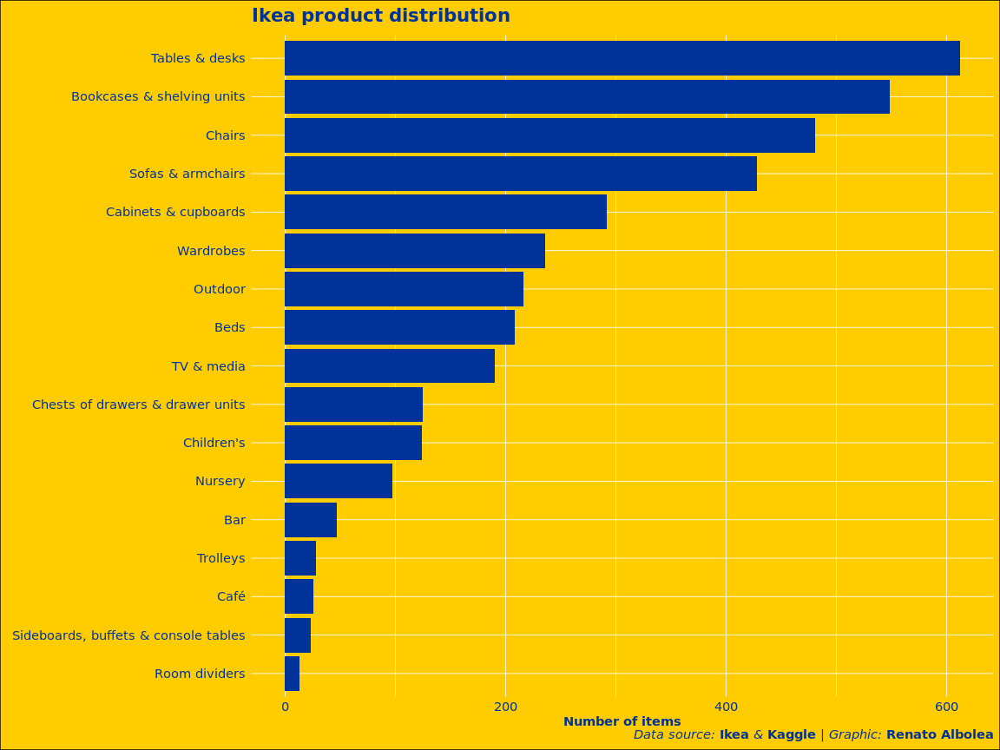<!-- -->


```r
ikea %>% 
  filter(promotion) %>% 
  ggplot(aes(x=discount_perc,
             y=fct_reorder(category, discount_perc, .fun='mean'))) + 
  geom_boxplot() +
  theme_roboto() +
  labs(title = "Trolleys is the most discounted item",
       x = "Discount Percentage",
       y = element_blank(),
       caption = caption_text) + 
  scale_x_continuous(labels=percent)
```

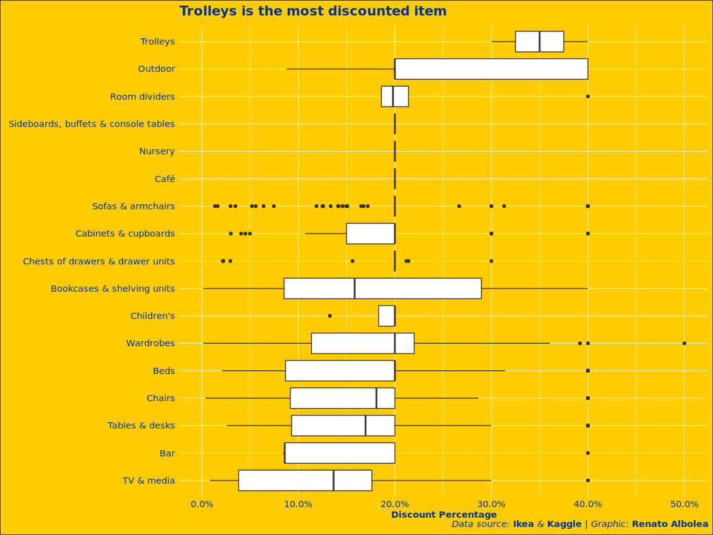<!-- -->


```r
ikea %>% 
  filter(promotion) %>% 
  ggplot(aes(x=discount_perc,
             y=fct_reorder(category_num, discount_perc, .fun='mean'))) + 
  geom_density_ridges(fill = "#003399",
                      alpha = 0.8) +
  theme_roboto() +
  labs(title = "Trolleys is the most discounted item",
       x = "Discount Percentage",
       y = element_blank(),
       caption = caption_text) + 
  scale_x_continuous(labels=percent)
```

```
## Picking joint bandwidth of 0.0454
```

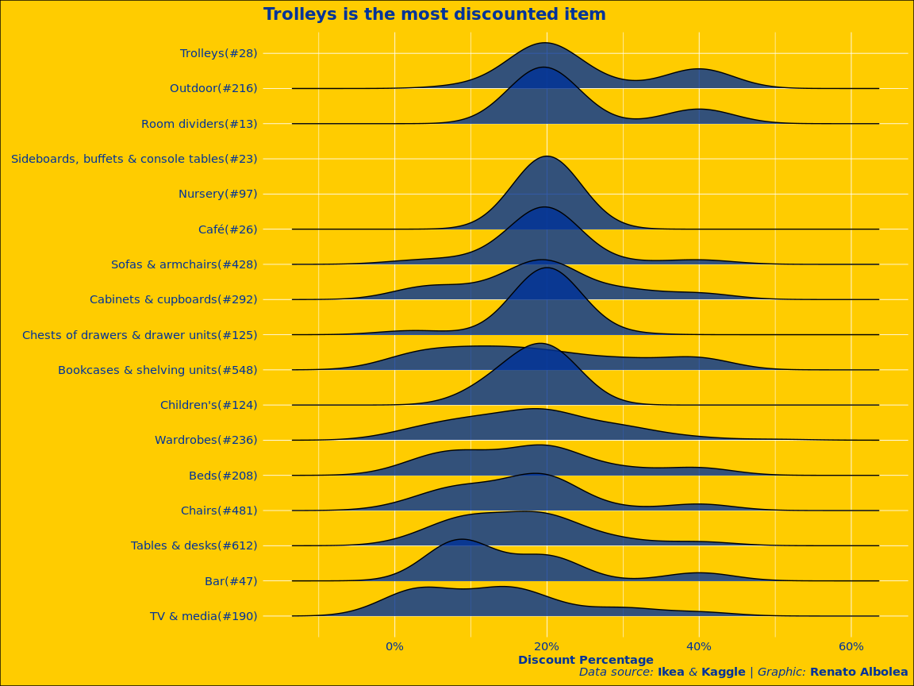<!-- -->


```r
ikea %>% 
  ggplot(aes(x=price,
             y=fct_reorder(category_num, price, .fun='mean'))) + 
  geom_boxplot() +
  theme_roboto() +
  labs(title = "On average, Wardrobes is the most expensive item",
       x = "Price in SR$",
       y = element_blank(),
       caption = caption_text) +
  scale_x_log10(labels=dollar)
```

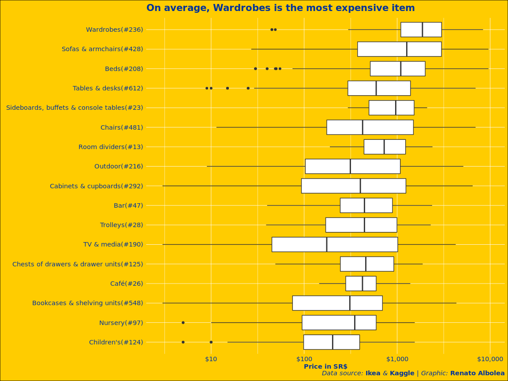<!-- -->


```r
ikea %>% 
  ggplot(aes(x=price,
             y=fct_reorder(category_num, price, .fun='mean'))) + 
  geom_density_ridges(fill = "#003399",
                      alpha = 0.8) +
  theme_roboto() +
  labs(title = "On average, Wardrobes is the most expensive item",
       x = "Price in SR$",
       y = element_blank(),
       caption = caption_text) +
  scale_x_log10(labels=dollar)
```

```
## Picking joint bandwidth of 0.165
```

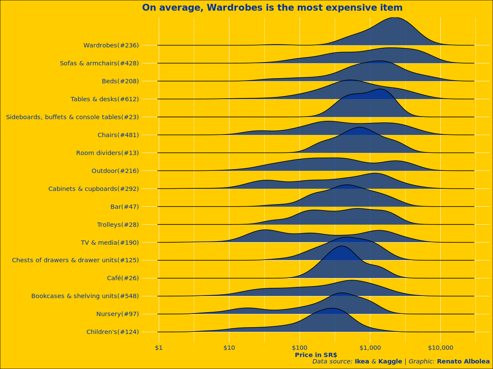<!-- -->

# Does having option of color influence the price?


```r
ikea %>% 
  filter(promotion) %>% 
  ggplot(aes(x=discount_perc,
             y=fct_reorder(category_num, discount_perc, .fun='mean'),
             fill = other_colors)) + 
  geom_boxplot() +
  theme_roboto() +
  labs(title = "Trolleys is the most discounted item",
       x = "Discount Percentage",
       y = element_blank(),
       caption = caption_text) + 
  scale_x_continuous(labels=percent)
```

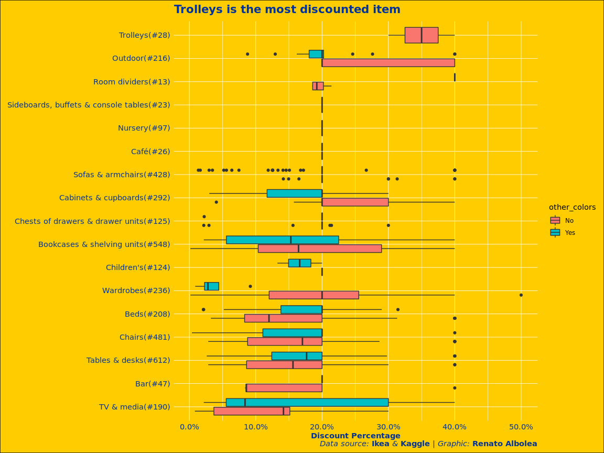<!-- -->


```r
ikea %>% 
  filter(promotion) %>% 
  ggplot(aes(x=discount_perc,
             y=fct_reorder(category_num, discount_perc, .fun='mean'),
             fill = other_colors)) + 
  geom_density_ridges(alpha = 0.8) +
  theme_roboto() +
  labs(title = "Trolleys is the most discounted item",
       x = "Discount Percentage",
       y = element_blank(),
       caption = caption_text) + 
  scale_x_continuous(labels=percent)
```

```
## Picking joint bandwidth of 0.0486
```

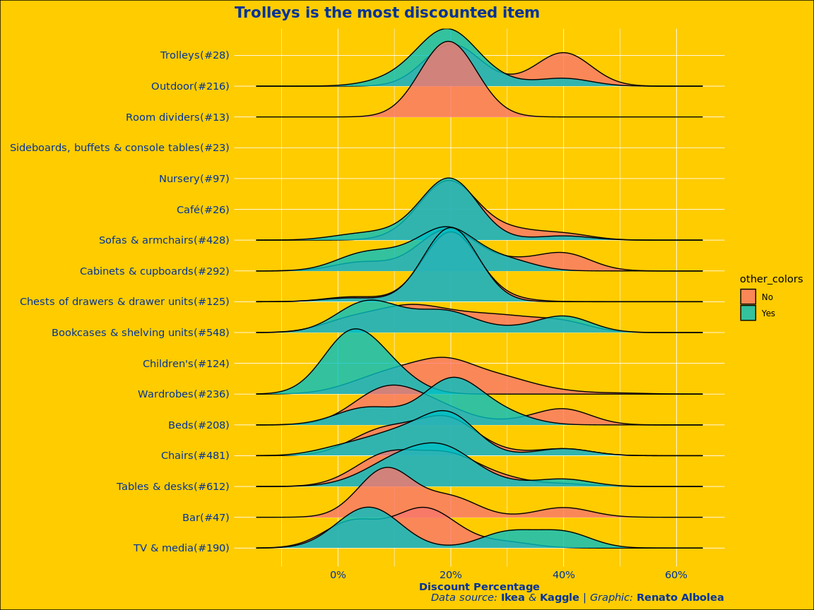<!-- -->


```r
ikea %>% 
  ggplot(aes(x=price,
             y=fct_reorder(category_num, price, .fun='mean'),
             fill = other_colors)) + 
  geom_boxplot() +
  theme_roboto() +
  labs(title = "On average, Wardrobes is the most expensive item",
       x = "Price in SR$",
       y = element_blank(),
       caption = caption_text) +
  scale_x_log10(labels=dollar)
```

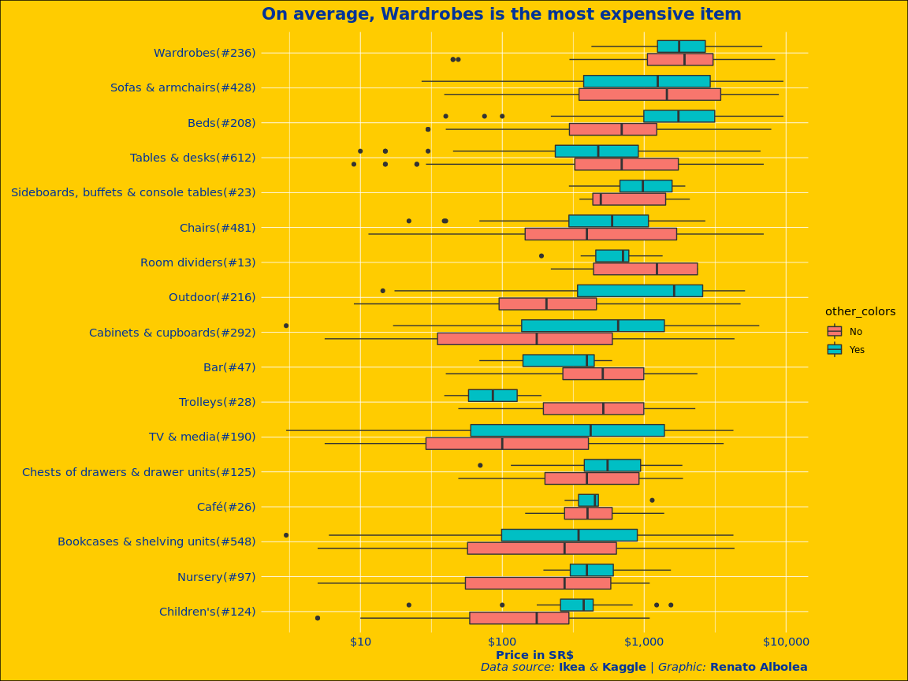<!-- -->


```r
ikea %>% 
  ggplot(aes(x=price,
             y=fct_reorder(category_num, price, .fun='mean'),
             fill = other_colors)) + 
  geom_density_ridges(alpha = 0.8) +
  theme_roboto() +
  labs(title = "On average, Wardrobes is the most expensive item",
       x = "Price in SR$",
       y = element_blank(),
       caption = caption_text) +
  scale_x_log10(labels=dollar)
```

```
## Picking joint bandwidth of 0.174
```

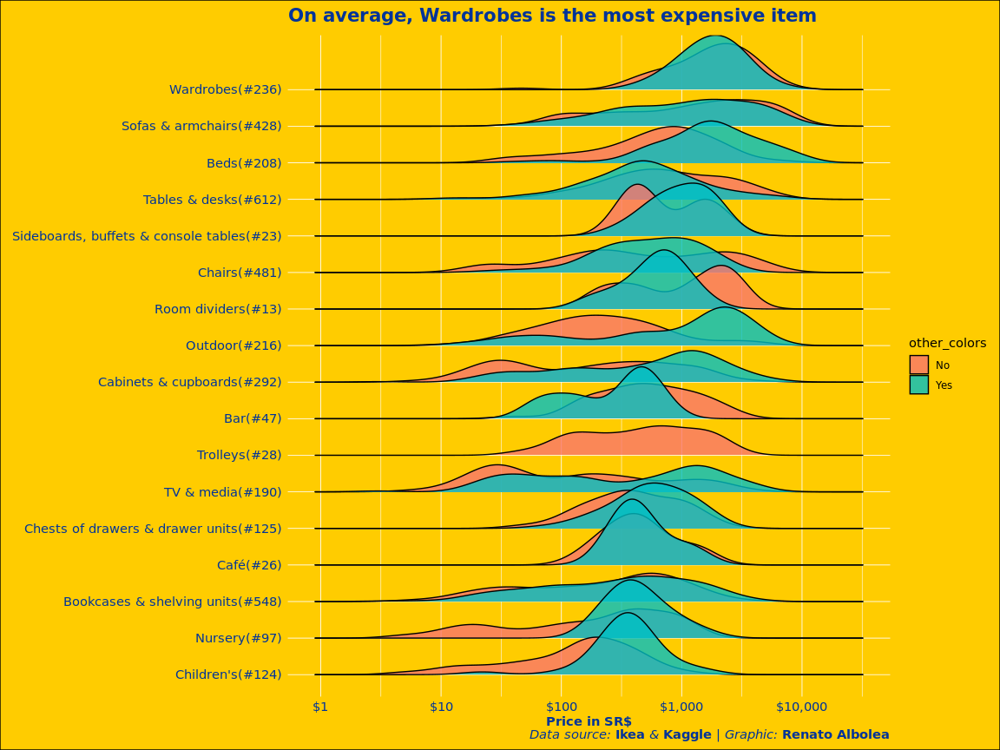<!-- -->

+ For some categories we can see price difference for having color options.
+ Bar and Trolley have a different behaviour. Only cheapper products offer color options.

# How well organized is the products?


```r
ikea %>% 
  count(name, category) %>% 
  filter(name != "Other") %>% 
  ggplot(aes(x=n,
             y=fct_reorder(name, n, sum) ,
             fill= fct_reorder(category, n, sum))) +
  geom_col() +
  theme_roboto() +
  scale_fill_discrete(guide = guide_legend(reverse = TRUE),
                      name = "Category") +
  labs(title = "The client cannot look to the name to have simmilar design accros categories",
       subtitle = "Few product names are used in the company",
       x = "Number of items",
       y = element_blank(),
       caption = caption_text) 
```

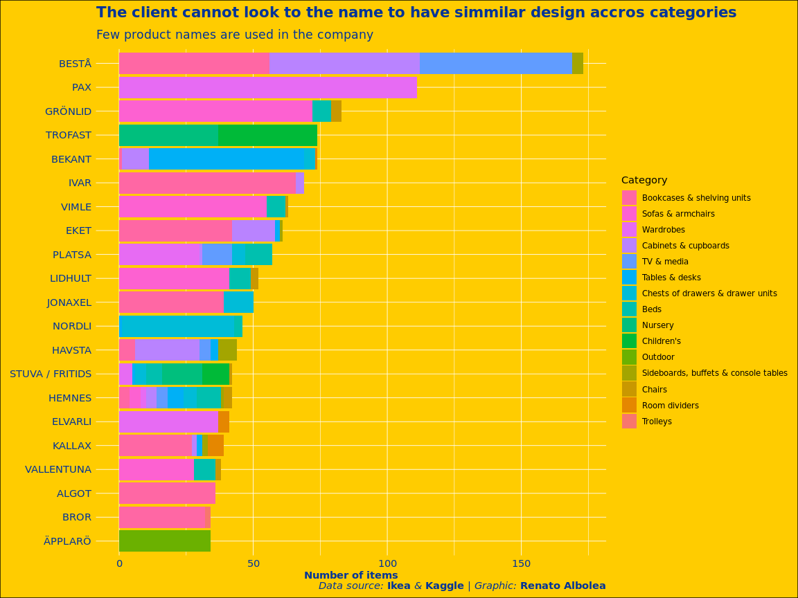<!-- -->

# Volume distribution


```r
ikea %>% 
  filter(!is.na(volume),
          volume > 0.01) %>% 
  arrange(desc(volume)) %>% 
  add_count(category, name = "category_count") %>% 
  mutate(category_num = glue("{category}(#{category_count})"),
         category_num = fct_reorder(category_num, volume, .fun='mean')) %>% 
  ggplot(aes(volume, category_num)) +
  geom_boxplot() +
  scale_x_log10() +
  theme_roboto() +
    labs(title = "As expected, sofas and wardrobes are the bigest items",
       subtitle = "",
       x = "Volume in m^3",
       y = element_blank(),
       caption = caption_text) 
```

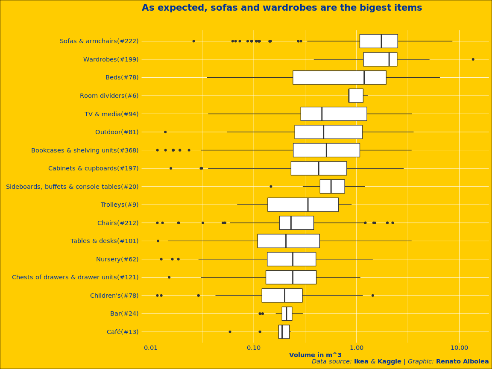<!-- -->

# Is there any relationship between price and volume?


```r
ikea %>% 
  filter(!is.na(volume),
          volume > 0.01) %>%
  mutate(category = fct_lump(category, 8)) %>% 
  add_count(category, name = "category_count") %>% 
  mutate(category_num = glue("{category}(#{category_count})"),
         category_num = fct_reorder(category_num, volume, .fun='mean'),
         ) %>% 
  ggplot(aes(price, volume)) + 
  geom_point() +
  geom_smooth(method="lm") +
  facet_wrap(~category) +
  theme_roboto() +
    labs(title = "The graph shows some relationship, but not completly linear",
       subtitle = "",
       x = "Volume in m^3",
       y = element_blank(),
       caption = caption_text) 
```

```
## `geom_smooth()` using formula 'y ~ x'
```

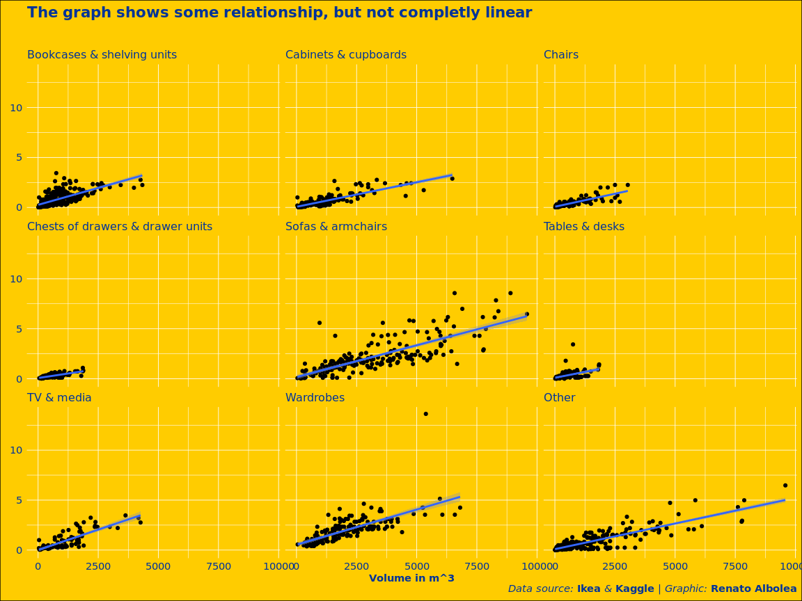<!-- -->


```r
ikea %>% 
  filter(!is.na(volume),
          volume > 0.01) %>%
  mutate(category = fct_lump(category, 8)) %>% 
  add_count(category, name = "category_count") %>% 
  mutate(category_num = glue("{category}(#{category_count})"),
         category_num = fct_reorder(category_num, volume, .fun='mean'),
         ) %>% 
  ggplot(aes(price, volume)) + 
  geom_point() +
  geom_smooth(method="lm") +
  facet_wrap(~category) +
  scale_x_log10() +
  scale_y_log10() +
  theme_roboto() +
    labs(title = "The relationship seems strong after the log transformation",
       subtitle = "",
       x = "Volume in m^3",
       y = element_blank(),
       caption = caption_text) 
```

```
## `geom_smooth()` using formula 'y ~ x'
```

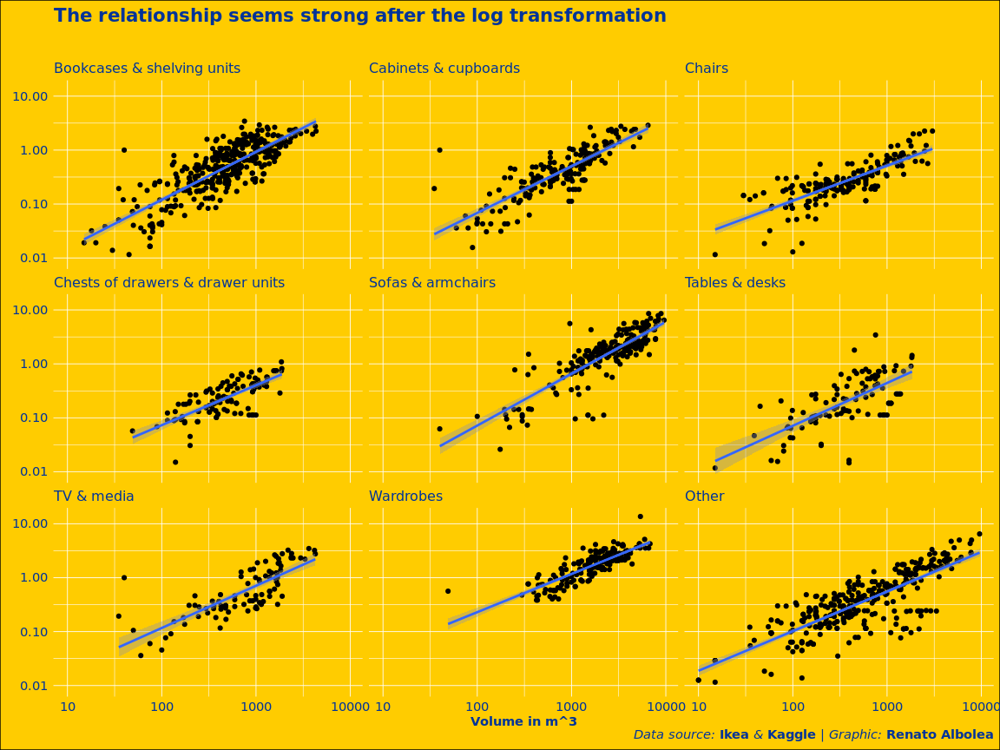<!-- -->


```r
ikea %>% 
  filter(!is.na(volume),
          volume > 0.01) %>%
  add_count(category, name = "category_count") %>% 
  mutate(category_num = glue("{category}(#{category_count})")) %>%
  group_by(category_num) %>% 
  summarise(price_vol_cor = round(cor(price,volume), 3),
            log_price_log_vol_cor = round(cor(log2(price), log2(volume)),3)) %>% 
  arrange(-log_price_log_vol_cor) %>% 
  kableExtra::kable(caption = "Corelation between price and volume") %>% 
  kableExtra::kable_styling(bootstrap_options = "striped")
```

```
## `summarise()` ungrouping output (override with `.groups` argument)
```

<table class="table table-striped" style="margin-left: auto; margin-right: auto;">
<caption>Corelation between price and volume</caption>
 <thead>
  <tr>
   <th style="text-align:left;"> category_num </th>
   <th style="text-align:right;"> price_vol_cor </th>
   <th style="text-align:right;"> log_price_log_vol_cor </th>
  </tr>
 </thead>
<tbody>
  <tr>
   <td style="text-align:left;"> Nursery(#62) </td>
   <td style="text-align:right;"> 0.883 </td>
   <td style="text-align:right;"> 0.889 </td>
  </tr>
  <tr>
   <td style="text-align:left;"> Trolleys(#9) </td>
   <td style="text-align:right;"> 0.828 </td>
   <td style="text-align:right;"> 0.878 </td>
  </tr>
  <tr>
   <td style="text-align:left;"> Children's(#78) </td>
   <td style="text-align:right;"> 0.885 </td>
   <td style="text-align:right;"> 0.877 </td>
  </tr>
  <tr>
   <td style="text-align:left;"> Outdoor(#81) </td>
   <td style="text-align:right;"> 0.931 </td>
   <td style="text-align:right;"> 0.873 </td>
  </tr>
  <tr>
   <td style="text-align:left;"> Sideboards, buffets &amp; console tables(#20) </td>
   <td style="text-align:right;"> 0.834 </td>
   <td style="text-align:right;"> 0.837 </td>
  </tr>
  <tr>
   <td style="text-align:left;"> Sofas &amp; armchairs(#222) </td>
   <td style="text-align:right;"> 0.793 </td>
   <td style="text-align:right;"> 0.836 </td>
  </tr>
  <tr>
   <td style="text-align:left;"> Wardrobes(#199) </td>
   <td style="text-align:right;"> 0.715 </td>
   <td style="text-align:right;"> 0.836 </td>
  </tr>
  <tr>
   <td style="text-align:left;"> Cabinets &amp; cupboards(#197) </td>
   <td style="text-align:right;"> 0.846 </td>
   <td style="text-align:right;"> 0.830 </td>
  </tr>
  <tr>
   <td style="text-align:left;"> Bookcases &amp; shelving units(#368) </td>
   <td style="text-align:right;"> 0.705 </td>
   <td style="text-align:right;"> 0.818 </td>
  </tr>
  <tr>
   <td style="text-align:left;"> Chairs(#212) </td>
   <td style="text-align:right;"> 0.839 </td>
   <td style="text-align:right;"> 0.799 </td>
  </tr>
  <tr>
   <td style="text-align:left;"> TV &amp; media(#94) </td>
   <td style="text-align:right;"> 0.824 </td>
   <td style="text-align:right;"> 0.788 </td>
  </tr>
  <tr>
   <td style="text-align:left;"> Chests of drawers &amp; drawer units(#121) </td>
   <td style="text-align:right;"> 0.780 </td>
   <td style="text-align:right;"> 0.750 </td>
  </tr>
  <tr>
   <td style="text-align:left;"> Tables &amp; desks(#101) </td>
   <td style="text-align:right;"> 0.454 </td>
   <td style="text-align:right;"> 0.684 </td>
  </tr>
  <tr>
   <td style="text-align:left;"> Beds(#78) </td>
   <td style="text-align:right;"> 0.817 </td>
   <td style="text-align:right;"> 0.654 </td>
  </tr>
  <tr>
   <td style="text-align:left;"> Room dividers(#6) </td>
   <td style="text-align:right;"> 0.586 </td>
   <td style="text-align:right;"> 0.558 </td>
  </tr>
  <tr>
   <td style="text-align:left;"> Café(#13) </td>
   <td style="text-align:right;"> -0.171 </td>
   <td style="text-align:right;"> 0.132 </td>
  </tr>
  <tr>
   <td style="text-align:left;"> Bar(#24) </td>
   <td style="text-align:right;"> -0.233 </td>
   <td style="text-align:right;"> -0.236 </td>
  </tr>
</tbody>
</table>


# Main factors that influences the price


```r
library(broom)
ikea %>% 
  filter(!is.na(volume),
          volume > 0.01) %>%
  mutate(category = fct_lump(category, 16),
         category_num = glue("{category}(#{category_count})"),
         category_num = fct_relevel(category_num, "Tables & desks(#612)"))%>% 
  add_count(category, name="category_count") %>% 
  lm(log2(price) ~ log2(volume) + category_num + other_colors, data = .) %>% 
  tidy(conf.int = TRUE) %>% 
  filter(term != "(Intercept)") %>% 
  mutate(term = ifelse(term == "log2(volume)", "Volume(doubling)", term),
         term = str_remove_all(term, "category_num"),
         term = fct_reorder(term, estimate)) %>% 
  ggplot(aes(estimate, term)) +
  geom_point() + 
  geom_errorbarh(aes(xmin = conf.low, xmax=conf.high), height=0.15, color = "#003399") +
  geom_vline(xintercept = 0, color = "#003399", lty=2 ) +
  theme_roboto() +
  xlim(-2,2)+
  theme_roboto() +
    labs(title = "Volume is a major contributor to price",
       subtitle = "",
       x = "Impact on price.\n Base Case: Tables & desk with no other color",
       y = element_blank(),
       caption = caption_text) 
```

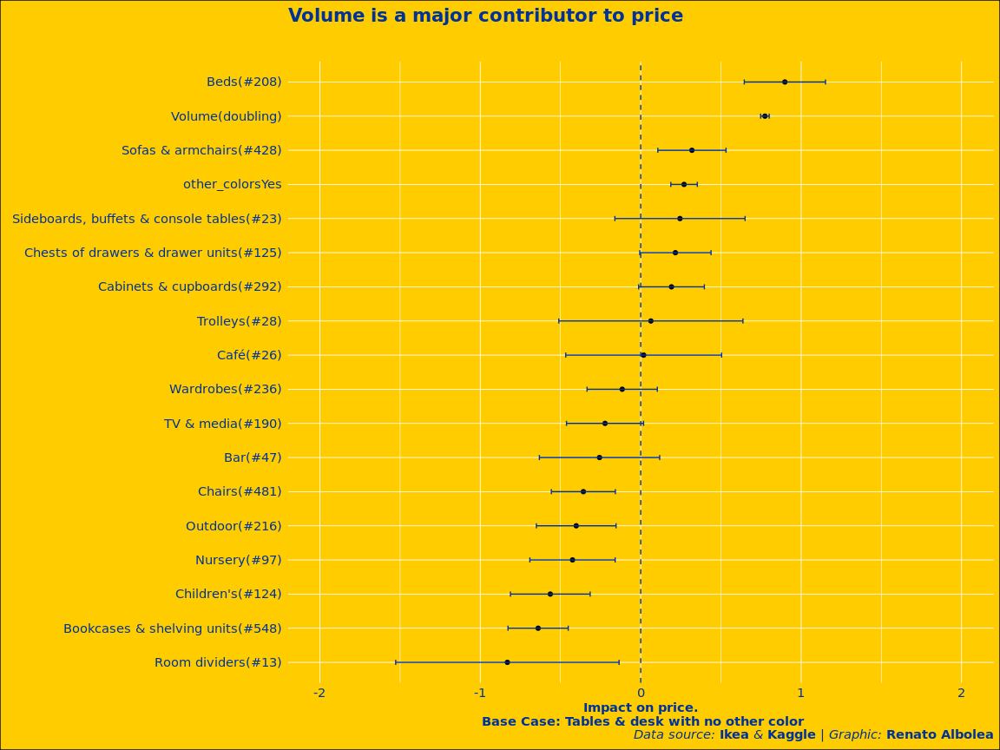<!-- -->

